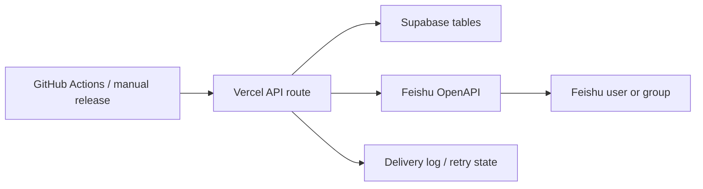

# ServerlessShip

**Serverless Feishu deploy notifier for minibot**

ServerlessShip is the lightweight serverless companion service for minibot deployments.
It is designed for a Vercel Hobby + Supabase Free stack and turns GitHub release or deploy events into Feishu notifications.

## One-line goal

When a minibot deployment finishes, ServerlessShip should send a polished Feishu notification to the right people without requiring a long-running backend.

## Why this name

- **Serverless**: the service is intended to run as Vercel serverless functions
- **Ship**: it focuses on shipping minibot releases
- **Feishu**: notifications are delivered to Feishu users or groups

## Intended stack

- Vercel Hobby for the API layer and scheduled jobs
- Supabase Free for persistence and lightweight state
- GitHub Actions for release or deployment triggers
- Feishu app or bot messaging for delivery

## MVP architecture

### Responsibilities

- **GitHub Actions**: emits deployment completed events or calls a webhook after `publish-desktop`
- **Vercel serverless**: receives the event, formats the message, and calls Feishu
- **Supabase**: stores recipients, notification targets, release history, and delivery logs
- **Feishu**: delivers either a direct user message or a group message depending on the configured channel

## Core job

- Receive deployment completion events
- Format a release notification card
- Send the message to the target Feishu recipient
- Record delivery state for retries and audit

## API entry points

- `GET /api/health` for uptime checks
- `POST /api/releases` for direct GitHub Actions or release pipeline calls
- `POST /api/webhooks/github` for GitHub release and workflow-run webhooks

## Suggested MVP data

- `projects`: minibot and future services
- `targets`: Feishu users, groups, or both
- `releases`: version, tag, build URL, status
- `deliveries`: one row per notification attempt
- `oauth_tokens` or `app_tokens`: Feishu access state

## What this intentionally does not do

- It does not run the actual build
- It does not replace GitHub Releases
- It does not try to become a general chat platform
- It does not keep a persistent worker process alive

## Good fit

This setup is a good fit if the first version only needs:

- one or a few deploy pipelines
- Feishu notification delivery
- simple retry and audit history
- low ops overhead
